# Terraform : NKS infra 구축

## 01. Terraform 사용 환경 세팅
### 1) terraform 설치
**아래 링크에서 local 환경에 맞는 version을 선택하여 terraform을 설치해야 함.**
- [Terraform install](https://developer.hashicorp.com/terraform/downloads?product_intent=terraform)
- window 에서는 다운로드 후, 폴더에 `terraform.exe` 파일을 집어넣고 **시스템 환경변수 편집** 에서 새로운 환경변수로 등록해주면 됨.
- 설치 확인을 위한 명령어 : `terraform -version`  
    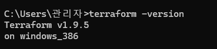   

### 2) tf file 다운로드
- terraform 으로 생성되는 리소스  
    1. VPC
    2. Subnet (default 5개)
    3. NKS cluster
    4. worker node (default 1개)
    5. bastion server

## 02. Terraform 실행
### 1) `terraform init`
```sh
# terraform code가 있는 디렉터리로 이동
cd ./Terraform/ver0.2  

# terraform init 실행
terraform init
```
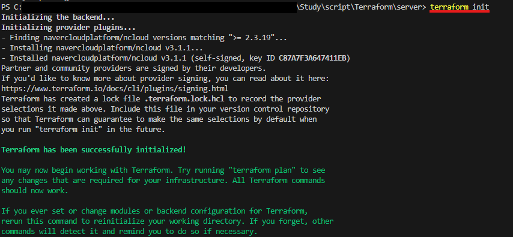  

### 2) `terraform plan`
```sh
# terraform plan 실행으로 생성될 resource 확인
terraform plan
```
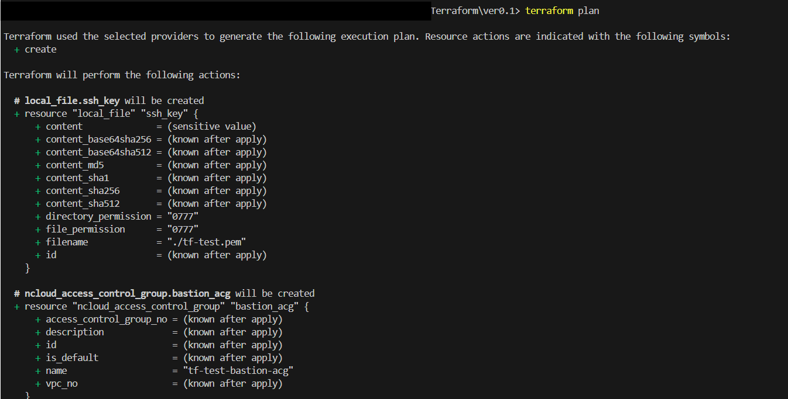  
### 3) `terraform apply`
```sh
# terraform apply 실행으로 실제 resource 생성
terraform apply

# 이후, yes 를 입력해주어야 생성이 진행됨
Do you want to perform these actions?
  Terraform will perform the actions described above.
  Only 'yes' will be accepted to approve.

  Enter a value: yes
```
- 생성이 완료되기까지 약 **30분** 소요
- 생성이 완료되면 아래와 같은 `output`을 확인할 수 있음
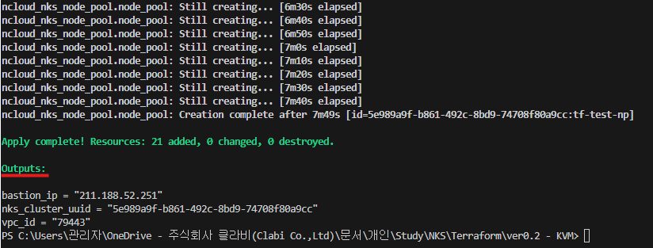  
### +) `terraform destroy`
- 테라폼으로 생성한 리소스들은 해당 명령어를 통해 한번에 삭제 가능함
- **Console 상에서 생성한 resource를 따로 tfstate에 업데이트 하지 않은 경우**에는 console로 생성하거나, 변경한 resource를 미리 삭제 후 해당 명령어 사용 가능
```sh
terraform destroy
```

## 03. 생성된 리소스 확인 및 설정
### 1) output 확인
1. 새로운 pem 키가 생성되어 local에 저장되었는지 확인
2. output이 제대로 출력되었는지 확인
### 2) console 상에서 확인
1. VPC 확인  
    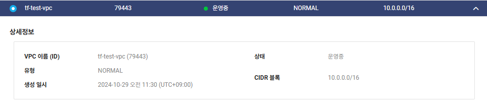  
2. Subnet 확인  
    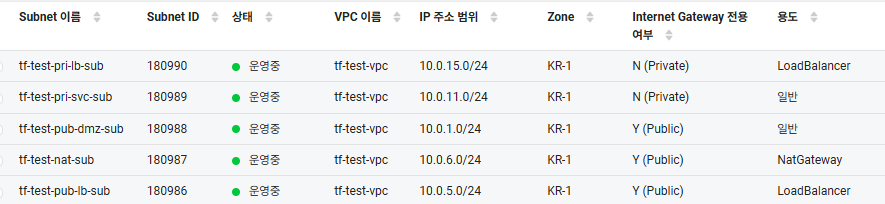  
3. Routing Table 확인  
    - private routing table에  `0.0.0.0/0`에 대하여 `NAT`로 설정되어 있어야 함    
     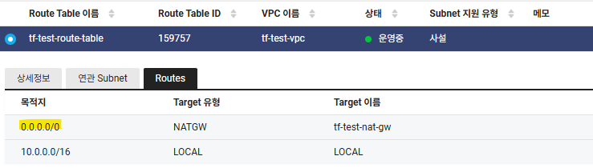  
4. Server 의 ACG 확인 및 변경   
    - **bastion**의 ACG를 신규 **생성한 ACG로 변경**해주어야 함  
    - {service-name}-bastion-acg 의 **inbound**  
        |protocol|source|port|  
        |:---:|:---:|:---:|  
        |TCP|`1.209.229.248/32`| 22 |
    - {service-name}-common-acg 의 **outbound**  
        |protocol|source|port|  
        |:---:|:---:|:---:|  
        |TCP|`0.0.0.0/0`| 1-65535 |
        |UDP|`0.0.0.0/0`| 1-65535 |
        |ICMP|`0.0.0.0/0`| - |    
5. NKS cluster 인증 모드 변경 및 IAM 보안주체 생성  
    - bastion 설정 스크립트 사용을 위해서는 클러스터 인증 모드를 configmap → **API 로 변경** 해주어야 함  
    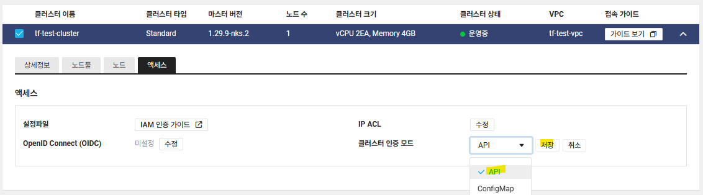  
    - 인증모드 변경 후 `IAM 액세스 항목 > + 생성하기` 를 통해 NKS에 접근할 user의 IAM을 등록해야 함  
    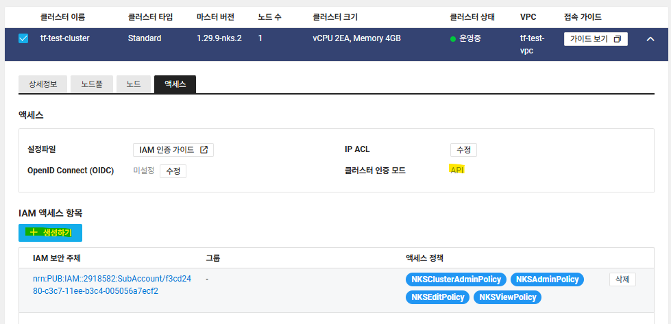  

## 04. ArgoCD 설치
### 1) console 상에서의 설정
- SSL 인증서 등록
    - `VPC > Certificate Manager` 에서 해당 서비스의 ArgoCD에서 사용할 도메인에 대한 인증서를 등록  
    - 인증서 등록이 완료되면 **Certificate No** 를 기록해둬야 함 (argocd 설치시 사용)  
    - DNS 서버(global DNS)에 해당 도메인의 CNAME 추가   
### 2) Bastion 내에서의 설정   
- **`argo-install.sh`** 파일 실행  
    ```sh
    vi argo-install.sh

    # source\sh\argo-install.sh 파일 내용 붙혀넣기

    chmod +x argo-install.sh

    ./argo-install.sh

    # Certificate No, 사용할 도메인 입력

    # 설치가 완료되면 초기 비밀번호가 출력됨
    ```
    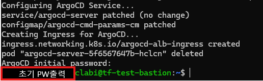
### 3) 정상 설치 확인
1. Console 에서 `ing-argocd` 생성 확인  
2. **DNS 서버에 해당 도메인의 A 레코드로 LB IP 등록**  
    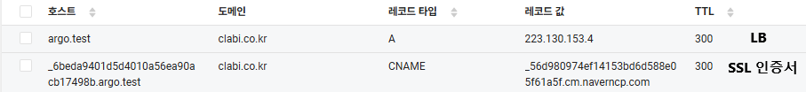  
3. 도메인을 통해 argocd 접근 확인
    - ID : `admin`
    - PW : `스크립트 실행 후 가장 마지막에 출력된 값`
    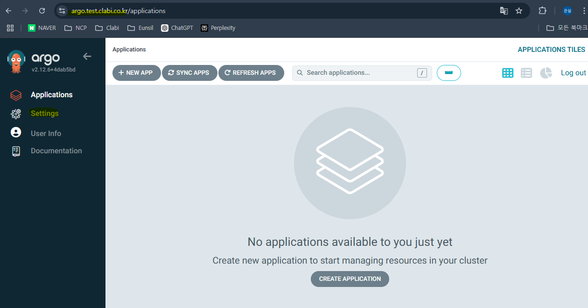
4. ArgoCD PW 변경
    - `User Info > UPDATE PASSWORD` 로 이동
    - 변경하기를 원하는 PW 입력 후 `SAVE NEW PASSWORD`
    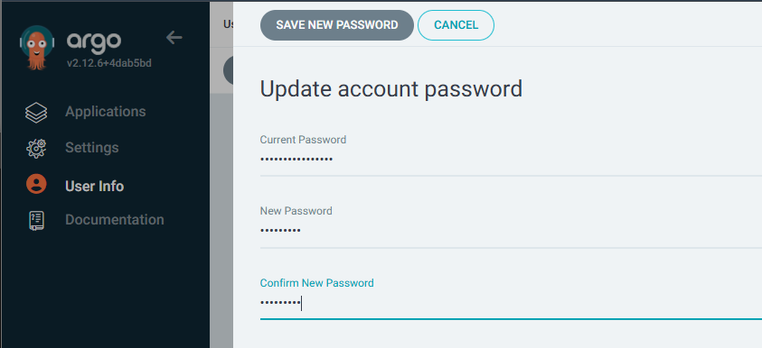
5. PW 변경 확인

- 이후 Settings의 다양한 설정들 변경도 가능하나, 범위에 따라 DevOps 팀 또는 개발사와 논의 필요

### information
- `ver 0.2-KVM` 디렉터리 구조
```
.
├── provider.tf             # provider 인증 정보 파일
├── main.tf                 # 테라폼 주요 리소스 정의 파일
├── data.tf                 # NCP의 리소스 정보를 받기 위한 파일
├── variables.tf            # 변수 정의 파일
├── outputs.tf              # 출력 정의 파일
└── terraform.tfvars        # 변수 값 설정 파일  
```
- `source` 디렉터리 구조
```
.
├── json /
├── png /
└── sh /                    # shell script를 모아둔 디렉터리
    ├── bastion-setup.sh    # kubectl, k9s 등 nks tools 세팅을 위한 script
    ├── argo-install.sh     # argocd 설치를 위한 script
    ├── rocky-init.sh       # rocky linux 초기 설정을 위한 script
    └── ubuntu-init.sh      # ubuntu 초기 설정을 위한 script
```