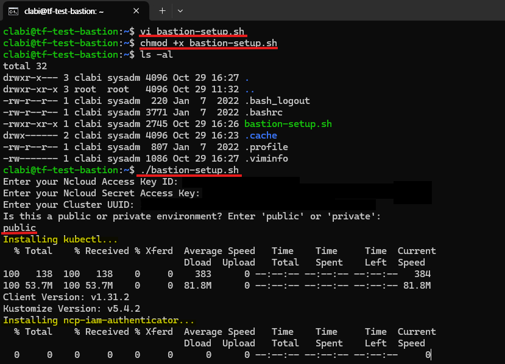

# Terraform : NKS infra 구축

## 01. Terraform 사용 환경 세팅
### 1) terraform 설치
**아래 링크에서 local 환경에 맞는 version을 선택하여 terraform을 설치해야 함.**
- [Terraform install](https://developer.hashicorp.com/terraform/downloads?product_intent=terraform)
- window 에서는 다운로드 후, 폴더에 `terraform.exe` 파일을 집어넣고 **시스템 환경변수 편집** 에서 새로운 환경변수로 등록해주면 됨.
- 설치 확인을 위한 명령어 : `terraform -version`  
       

### 2) tf file 다운로드
- terraform 으로 생성되는 리소스  
    1. VPC
    2. Subnet (default 5개)
    3. NKS cluster
    4. worker node (default 1개)
    5. bastion server

- `ver 0.2-KVM` 디렉터리 구조
```
.
├── provider.tf             # provider 인증 정보 파일
├── main.tf                 # 테라폼 주요 리소스 정의 파일
├── data.tf                 # NCP의 리소스 정보를 받기 위한 파일
├── variables.tf            # 변수 정의 파일
├── outputs.tf              # 출력 정의 파일
└── terraform.tfvars        # 변수 값 설정 파일  
```
- `source` 디렉터리 구조
```
.
├── json /
├── png /
└── sh /                    # shell script를 모아둔 디렉터리
    ├── bastion-setup.sh    # 
    ├── argo-install.sh     # 
    ├── rocky-init.sh       # rocky linux 초기 설정을 위한 script
    └── ubuntu-init.sh      # ubuntu 초기 설정을 위한 script
```

### 3) `terraform.tfvars` 파일 커스터마이징  
1. IAM 추가  
    - `site` 설정
        - default는 `pub` 으로 **민간존**임
        - 공공존 : `gov`
        - 금융존 : `fin`
    - access key와 secret key를 알맞는 것으로 변경  
    - 보안을 위해서 api key를 `.tfvars` 파일에 집어넣지 않고, `terraform apply` 시 입력할 수도 있음
2. service name 설정  
    - 리소스 naming 중 가장 앞단에 통일성 있게 붙을 service name을 설정  
    ```md
    ex) service name = "es-tf-test" 로 설정 시,   
    - vpc 명 : es-tf-test-vpc  
    - nks cluster 명 : es-tf-test-cluster  
    - bastion 명 : es-tf-test-bastion 등...  
    ```  
3. network 설정  
    - `vpc_cidr` 를 지정하여 원하는 대역대 설정  
    - public subnet    
        - `pub_dmz_subnet_cidr` : public 단에서 필요한 서버(bastion 등) 배치를 위한 대역대 지정   
        - `pub_lb_subnet_cidr` : public loadbalancer를 위한 대역대 지정 
        - `pub_nat_subnet_cidr` : NAT 사용을 위한 대역대 지정  
            (*NKS를 private하게 사용하기 위해서는 필수적으로 NAT를 배치해야 함*)   
    - private subnet  
        - `pri_svc_subnet_cidr` : 실제 서비스(NKS 등)를 배치할 대역대 지정   
        - `pri_lb_subnet_cidr` : private loadbalancer를 위한 대역대 지정  
            (*NKS를 private하게 사용하기 위해서는 필수적으로 해당 서브넷을 지정해야 함*)
    - 필요에 따라 `pri_db_subnet_cidr` 를 주석해제하여 3tier로 구성할 수 있음  
4. init script 경로 정의
    - bastion 서버 생성 시, local에 있는 init script를 추가할 수 있음  
    - 원활한 서버 접근을 위해 사용할 bastion 서버의 OS에 맞는 init script 경로를 지정  
        - default로 ubuntu로 생성함   
        - init script를 통해 ID : `clabi` | PW : `script 확인` 로 로그인 가능한 계정이 생성됨  
5. bastion 접근 허용 ip 정의  
    - default로 clabi IP가 22번 port (ssh) 로 허용됨  
    - 필요에 따라 `client_ip`를 주석해제하여 clabi IP가 아닌 별도의 IP를 허용할 수 있음  
        (*ver 0.1에서는 기본적으로 1개의 IP에 한하여 인바운드 허용 가능*)
6. worker node 설정
    - 갯수 : default 1개 
    - storage size : default 100GB (100GB 이상 설정 가능)


### 4) `data.tf` 파일 커스터마이징
1. bastion 서버 스펙 설정  
    - `server_image_name` : ubuntu-22.04-base | rocky-8.10-base | ubuntu-20.04-base | etc... 
    - `server_spec_code` 
        - c2-g3 \| c4-g3 \| c8-g3 ... (High-CPU) 
        - s2-g3 \| s4-g3 \| s8-g3 ... (Stardard) 
        - m2-g3 ... (High-Memory)  etc...
2. NKS cluster 버전 설정
    - `ncloud_nks_version` 의 `values` 값을 원하는 version으로 설정해줄 수 있음
3. NKS worker node 스펙 설정
    - `ncloud_nks_server_images` : ubuntu-22.04 | ubuntu-20.04 (gpu version도 존재)
    - `ncloud_nks_server_products`
        - `product_type` : HICPU | STAND | HIMEM 에 따라 아래 CPU 와 MEM size가 달라짐
        - `cpu_count`
        - `memory_size`
        - 일치하는 값을 찾지 못하면 `terraform plan` 시 error가 발생하므로 주의해야 함

## 02. Terraform 실행
### 1) `terraform init`
```sh
# terraform code가 있는 디렉터리로 이동
cd ./Terraform/ver0.2  

# terraform init 실행
terraform init
```
  

### 2) `terraform plan`
```sh
# terraform plan 실행으로 생성될 resource 확인
terraform plan
```
  
### 3) `terraform apply`
```sh
# terraform apply 실행으로 실제 resource 생성
terraform apply

# 이후, yes 를 입력해주어야 생성이 진행됨
Do you want to perform these actions?
  Terraform will perform the actions described above.
  Only 'yes' will be accepted to approve.

  Enter a value: yes
```
- 생성이 완료되기까지 약 **30분** 소요
- 생성이 완료되면 아래와 같은 `output`을 확인할 수 있음
  
### +) `terraform destroy`
- 테라폼으로 생성한 리소스들은 해당 명령어를 통해 한번에 삭제 가능함
- **Console 상에서 생성한 resource를 따로 tfstate에 업데이트 하지 않은 경우**에는 console로 생성하거나, 변경한 resource를 미리 삭제 후 해당 명령어 사용 가능
```sh
terraform destroy
```

## 03. 생성된 리소스 확인 및 설정
### 1) output 확인
1. 새로운 pem 키가 생성되어 local에 저장되었는지 확인
2. output이 제대로 출력되었는지 확인
### 2) console 상에서 확인
1. VPC 확인  
      
2. Subnet 확인  
      
3. Routing Table 확인  
    - private routing table에  `0.0.0.0/0`에 대하여 `NAT`로 설정되어 있어야 함    
       
4. Server 의 ACG 확인 및 변경   
    - **bastion**의 ACG를 신규 **생성한 ACG로 변경**해주어야 함  
    - {service-name}-bastion-acg 의 **inbound**  
        |protocol|source|port|  
        |:---:|:---:|:---:|  
        |TCP|`1.209.229.248/32`| 22 |
    - {service-name}-common-acg 의 **outbound**  
        |protocol|source|port|  
        |:---:|:---:|:---:|  
        |TCP|`0.0.0.0/0`| 1-65535 |
        |UDP|`0.0.0.0/0`| 1-65535 |
        |ICMP|`0.0.0.0/0`| - |    
5. NKS cluster 인증 모드 변경 및 IAM 보안주체 생성  
    - bastion 설정 스크립트 사용을 위해서는 클러스터 인증 모드를 configmap → **API 로 변경** 해주어야 함  
      
    - 인증모드 변경 후 `IAM 액세스 항목 > + 생성하기` 를 통해 NKS에 접근할 user의 IAM을 등록해야 함  
      

### 3) bastion 설정
1. bastion 접속
```sh
ssh clabi@<bastion 공인 IP>

# PW : 스크립트 확인 (필요에 따라 변경)
```
2. `..source/sh/bastion-setup.sh` 파일 실행
- **`bastion-setup.sh`** 파일을 실행하여 `kubectl`, `ncp-iam-authentication`, `k9s`를 설치  
    ```sh
    vi bastion-setup.sh

    # source\sh\bastion-setup.sh 파일 내용 붙혀넣기

    chmod +x bastion-setup.sh

    ./bastion-setup.sh

    # IAM 정보와 생성한 NKS cluster UUID 입력

    # 공공일 경우, private 
    # 민간일 경우, public 입력  
    ```  
       
3. 정상 설치 확인  
    ```sh
    source .bash_profile

    kubectl get no

    k9s # 정상 접근 확인
    ```
    
## 04. ArgoCD 설치
### 1) console 상에서의 설정
- SSL 인증서 등록
    - `VPC > Certificate Manager` 에서 해당 서비스의 ArgoCD에서 사용할 도메인에 대한 인증서를 등록  
    - 인증서 등록이 완료되면 **Certificate No** 를 기록해둬야 함 (argocd 설치시 사용)  
    - DNS 서버(global DNS)에 해당 도메인의 CNAME 추가   
### 2) Bastion 내에서의 설정   
- **`argo-install.sh`** 파일 실행  
    ```sh
    vi argo-install.sh

    # source\sh\argo-install.sh 파일 내용 붙혀넣기

    chmod +x argo-install.sh

    ./argo-install.sh

    # Certificate No, 사용할 도메인 입력

    # 설치가 완료되면 초기 비밀번호가 출력됨
    ```
    
### 3) 정상 설치 확인
1. Console 에서 `ing-argocd` 생성 확인  
2. **DNS 서버에 해당 도메인의 A 레코드로 LB IP 등록**  
      
3. 도메인을 통해 argocd 접근 확인
    - ID : `admin`
    - PW : `스크립트 실행 후 가장 마지막에 출력된 값`
    
4. ArgoCD PW 변경
    - `User Info > UPDATE PASSWORD` 로 이동
    - 변경하기를 원하는 PW 입력 후 `SAVE NEW PASSWORD`
    
5. PW 변경 확인

- 이후 Settings의 다양한 설정들 변경도 가능하나, 범위에 따라 DevOps 팀 또는 개발사와 논의 필요