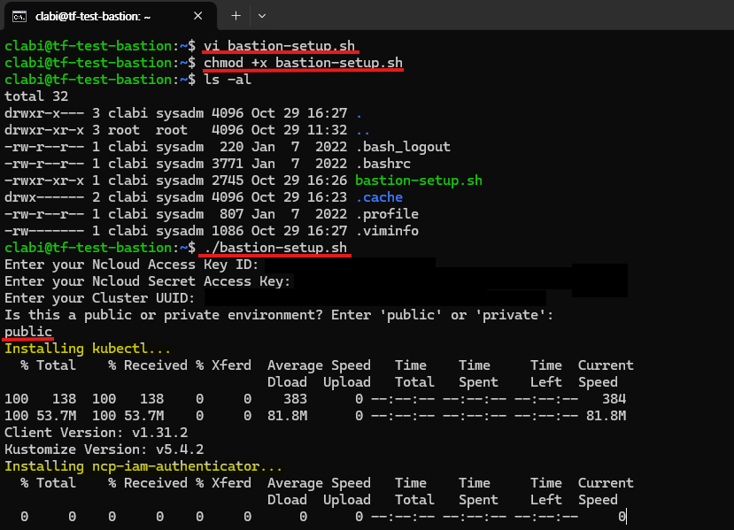
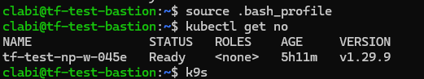

## ver0.2 사용 설명

### `terraform.tfvars` 파일 커스터마이징 
1. IAM 설정  
    - **`site` 설정**
        - default는 `pub` 으로 **민간존**임
        - 공공존 : `gov`
        - 금융존 : `fin`
    - access key와 secret key를 알맞는 것으로 변경  
    - 보안을 위해서 api key를 `.tfvars` 파일에 집어넣지 않고, `terraform apply` 시 입력할 수도 있음
2. **service name 설정** 
    - 리소스 naming 중 가장 앞단에 통일성 있게 붙을 service name을 설정  
    ```md
    ex) service name = "es-tf-test" 로 설정 시,   
    - vpc 명 : es-tf-test-vpc  
    - nks cluster 명 : es-tf-test-cluster  
    - bastion 명 : es-tf-test-bastion 등...  
    ```  
3. **VPC 및 Subnet 설정**
    - `vpc_cidr` 를 지정하여 원하는 대역대 설정  
    - **public subnet**    
        - `pub_dmz_subnet_cidr` : public 단에서 필요한 서버(bastion 등) 배치   
        - `pub_lb_subnet_cidr` : public loadbalancer
        - `pub_nat_subnet_cidr` : NAT  
            (*NKS를 private하게 사용하기 위해서는 필수적으로 NAT를 배치해야 함*)   
    - **private subnet**  
        - `pri_svc_subnet_cidr` : 실제 서비스(NKS 등)를 배치   
        - `pri_lb_subnet_cidr` : private loadbalancer  
            (*NKS를 private하게 사용하기 위해서는 필수적으로 해당 서브넷을 지정해야 함*)
    - 필요에 따라 `pri_db_subnet_cidr` 를 주석해제하여 3tier로 구성할 수 있음  
4. **Hypervisor 설정**
    - ver0.2를 기준으로 변경 필요 없음

5. **bastion 서버 설정**
    - `server_image_name` :
    - `server_spec_code` : 
    - `bastion_init_script_path` : init script 경로 정의
        - bastion 서버 생성 시, local에 있는 init script를 추가할 수 있음  
        - 원활한 서버 접근을 위해 사용할 bastion 서버의 OS에 맞는 init script 경로를 지정  
            - default로 ubuntu로 생성함   
            - init script를 통해 ID : `clabi` | PW : `script 확인` 로 로그인 가능한 계정이 생성됨  
    - `client_ip` : bastion 접근 허용 ip 정의  
        - default로 clabi IP가 22번 port (ssh) 로 허용됨  
        - 필요에 따라 `client_ip`를 주석해제하여 clabi IP가 아닌 별도의 IP를 허용할 수 있음  
            (*ver 0.2에서는 기본적으로 1개의 IP에 한하여 인바운드 허용 가능*)
6. **NKS 설정**
    - `nks_version` : 사용할 nks version
    - `node_image` : worker node 이미지  
        (*KVM은 default가 ubuntu 22.04*)  
    - `node_count` : 사용할 worker node의 갯수  
    - `node_product_type` : 각 worker node의 product type    
        (*type에 따라 CPU와 mem size를 조정해야 함*)
    - `node_cpu_core` : 각 worker node의 cpu core수  
        (*sting 으로 기재*)
    - `node_memory_size` : 각 worker node의 memory size
    - `node_storage_size` : 각 worker node의 storage size

### 생성된 bastion 내에서의 설정
1. bastion 접속
```sh
ssh clabi@<bastion 공인 IP>

# PW : 스크립트 확인 (필요에 따라 변경)
```
2. `..source/sh/bastion-setup.sh` 파일 실행
- **`bastion-setup.sh`** 파일을 실행하여 `kubectl`, `ncp-iam-authentication`, `k9s`를 설치  
    ```sh
    vi bastion-setup.sh

    # source\sh\bastion-setup.sh 파일 내용 붙혀넣기

    chmod +x bastion-setup.sh

    ./bastion-setup.sh

    # IAM 정보와 생성한 NKS cluster UUID 입력

    # 공공일 경우, private 
    # 민간일 경우, public 입력  
    ```  
       
3. 정상 설치 확인  
    ```sh
    source .bash_profile

    kubectl get no

    k9s # 정상 접근 확인
    ```
    